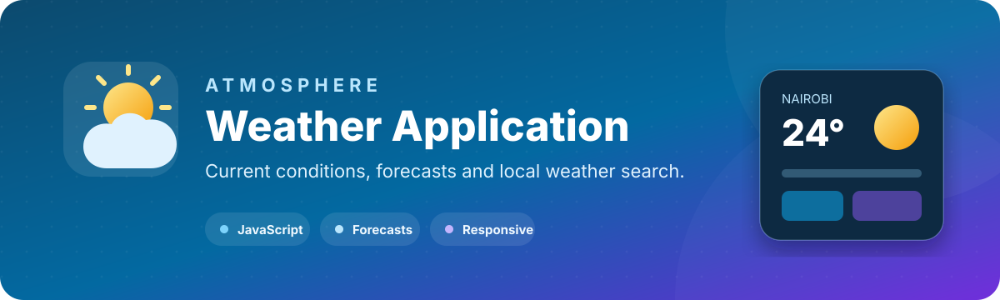

<p align="center">
  
</p>

<p align="center">
  
  
  
</p>

## Overview

**Atmosphere** is a responsive weather application built with vanilla JavaScript. It supports city search, geolocation, current conditions, temperature-unit switching, recent searches, and five-day forecast data.

The project demonstrates browser API integration, asynchronous JavaScript, DOM state management, local storage, and responsive interface design.

## Features

| Area | Capability |
| --- | --- |
| **Search** | Find current weather by city name |
| **Location** | Request weather using browser geolocation |
| **Forecast** | Display five-day forecast information |
| **Units** | Switch between Celsius and Fahrenheit |
| **History** | Save recent searches in local storage |
| **Details** | Temperature, conditions, humidity, wind, pressure, and feels-like values |
| **Experience** | Loading, error, empty, and responsive states |

## Technology

| Layer | Implementation |
| --- | --- |
| **Structure** | Semantic HTML5 |
| **Styling** | Custom CSS, responsive breakpoints, gradients, and animation |
| **Logic** | Vanilla JavaScript ES6+ |
| **Data source** | OpenWeather API |
| **Storage** | Browser local storage |
| **Location** | Browser Geolocation API |

## Project structure

```text
Weather-App/
├── index.html
├── style.css
├── script.js
├── config.example.js
├── js/
│   ├── weather-api.js
│   ├── weather-ui.js
│   └── weather-utils.js
├── images/
├── assets/
│   └── weather-app-banner.svg
└── README.md
```

## Run locally

### 1. Clone the project

```bash
git clone https://github.com/nuru999/Weather-App.git
cd Weather-App
```

### 2. Create a local configuration

```bash
cp config.example.js config.js
```

Edit `config.js` and insert your own OpenWeather API key:

```javascript
window.WEATHER_APP_CONFIG = {
  apiKey: "YOUR_OPENWEATHER_API_KEY"
};
```

`config.js` is ignored by Git and must never be committed.

### 3. Start a local server

```bash
python -m http.server 8000
```

Open [http://localhost:8000](http://localhost:8000).

## Security and deployment

A previously hard-coded API key has been removed from the current source. Because earlier commits remain in Git history, that old key must be revoked in the OpenWeather account.

Client-side JavaScript cannot truly hide an API key. For a public deployment:

1. Put the weather request behind a small backend or serverless function.
2. Store the key only in server-side environment variables.
3. Validate location parameters and apply rate limiting.
4. Have the browser call the proxy instead of OpenWeather directly.

Until a proxy is added, the GitHub Pages version displays a configuration warning and the application should be run locally with a personal development key.

## Recommended improvements

- Replace the client-side key flow with a backend proxy or keyless weather provider.
- Consolidate the duplicated API logic in `script.js` and `js/weather-api.js`.
- Add automated tests for unit conversion and weather-code formatting.
- Add severe-weather alerts and accessibility announcements.
- Add a deployment workflow after the data-source strategy is secured.

---

<p align="center">
  Built by <a href="https://github.com/nuru999">Nuru Amudi</a>.
</p>